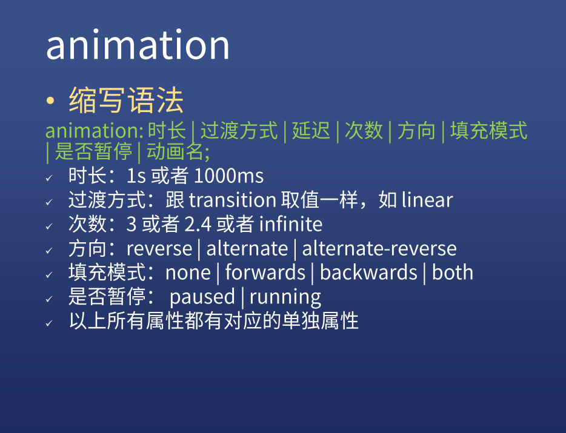

# CSS 知识总结
### 1、浏览器渲染原理
1. 根据HTML构建HTML树
2. 根据CSS构建CSS树
3. 将两棵树合并成一颗渲染树
4. layout布局(文档流，盒模型，计算大小和位置)
5. paint绘制(边框颜色、文字颜色、阴影等画出来)
6. compose合成(根据层叠关系展示画面)


### 2、更新方式
1. JS/CSS>样式>布局>绘制>合成
2. JS/CSS>样式>绘制>合成(改变背景颜色)
3. JS/CSS>样式>合成(改变transform,只需composite)


---
### 2、transition动画
transition: 属性名 时长 过渡方式 延迟


#### 语法
```css
/* Apply to 1 property */
/* property name | duration */
transition: margin-right 4s;

/* property name | duration | delay */
transition: margin-right 4s 1s;

/* property name | duration | timing function */
transition: margin-right 4s ease-in-out;

/* property name | duration | timing function | delay */
transition: margin-right 4s ease-in-out 1s;

/* Apply to 2 properties */
transition: margin-right 4s, color 1s;

/* Apply to all changed properties */
transition: all 0.5s ease-out;

/* Global values */
transition: inherit;
transition: initial;
transition: unset;
```


---
### 3、animation动画
animation:时长 过渡方式 延迟 次数 方向 填充模式 是否暂停 动画名

#### 语法
```css
/* @keyframes duration | timing-function | delay |
   iteration-count | direction | fill-mode | play-state | name */
animation: 3s ease-in 1s 2 reverse both paused slidein;

/* @keyframes duration | timing-function | delay | name */
animation: 3s linear 1s slidein;

/* @keyframes duration | name */
animation: 3s slidein;
```

