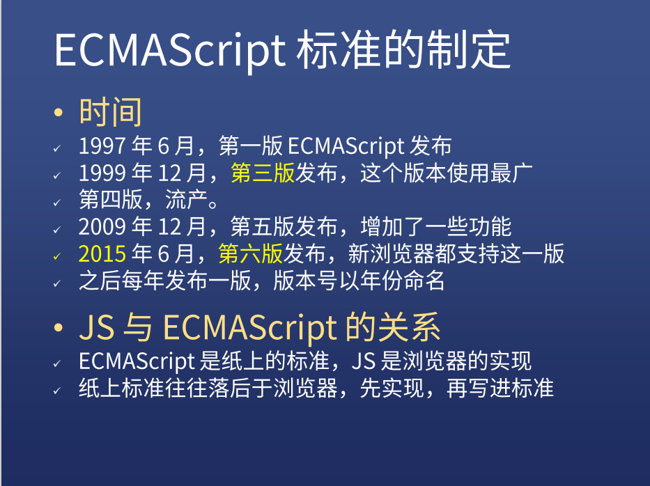
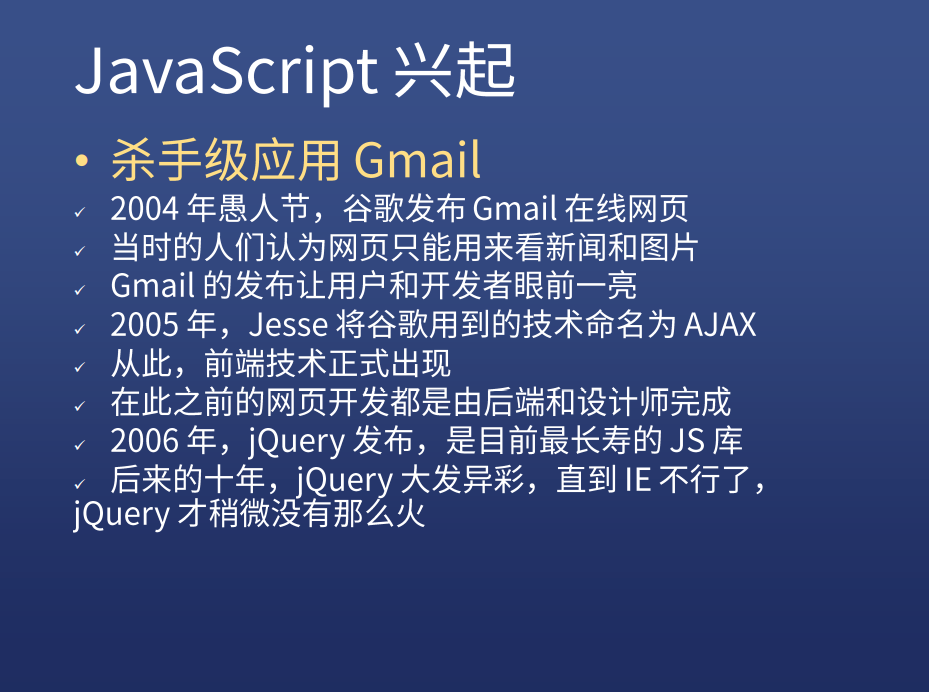
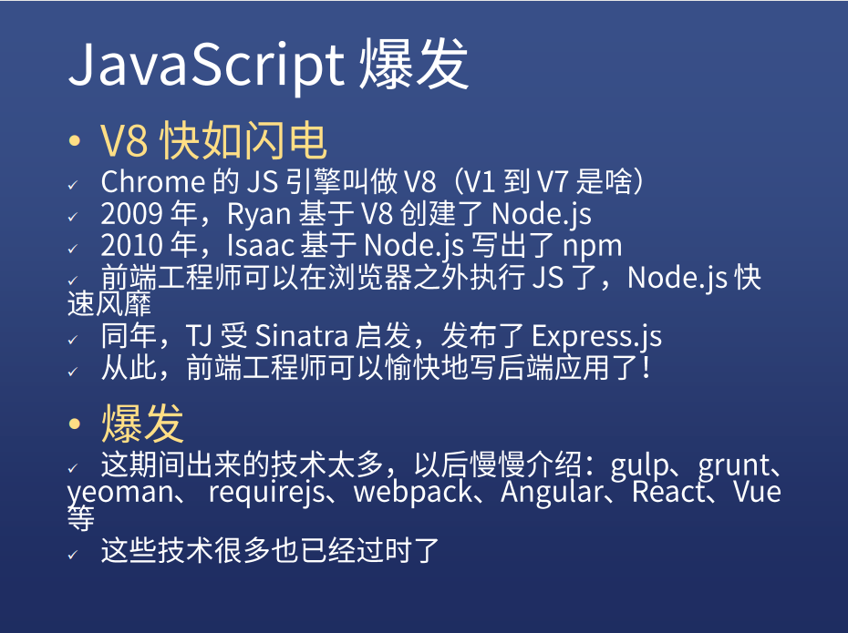

# Javascript诞生记

### 1、备胎的诞生
网景公司急需一种网页脚本语言，使得浏览器可以与网页互动，所以布兰登(Brendan Eich)，临危受命用短短的十天编写了JS的最初版本。

### 2、蹭富婆的重要性
由于但是Java的发展火热，网景公司决定蹭一波Java的热度，将Mocha经多次修改成JavaScript，并在随后的双J之争中，在浏览器上大获胜利。

### 3、正室的眼红
高富帅的微软在1996年8月发布IE3，并支持JScript，开始与一众备胎浏览器进行对决。

### 4、备胎的反击
网景公司向ECMA提交语言标准，JS语言悄然蜕变，成为了ECMAScript

### 5、正室的小手段
高富帅的微软利用自己之前的资本，将操作系统和浏览器进行绑定，强化了垄断，让身为备胎的网景公司节节败退，并最终破罐破摔将浏览器开源

### 6、正室的懈怠
高富帅的微软在超高的占有率面前飘了，并且伴随着自己一系列的瞎操作，导致问题频频。虽然重组的备胎一度抢占了微软的份额，但是在巨头面前还是败下阵来。

### 7、另一个高富帅带着备胎的灵魂趁虚而入
另外一个年轻的高富帅看到了微软的软肋，在2004开始便和浏览器老婆搞地下情，并于2008正式官宣，但是处于正室的微软觉得自己家大业大，丝毫没有在意这个对手，但是谷歌这个对手一直猥琐发育，步步紧逼，并于2016年成为浏览器端的霸主抱得美人归。

### 8、后话

