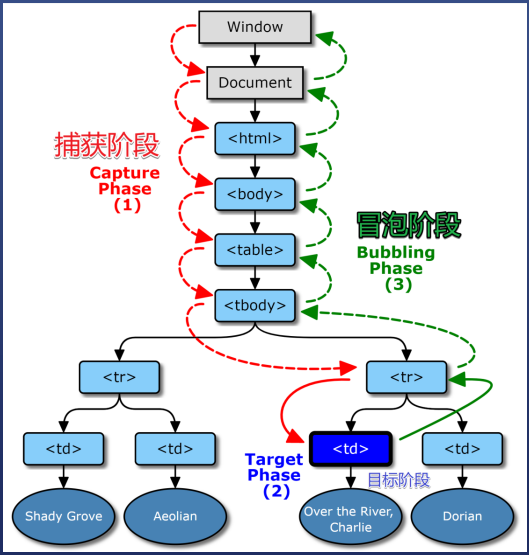

# DOM 
### 1、DOM 事件模型
DOM是个树形结构，当我们在页面上单击一个按钮，页面上哪些元素会触发这个事件，是发生在这个按钮上，还是这个按钮的容器元素（我们说父元素）也会触发这个点击事件呢？

就像学校发孩子成绩单，是要先发给孩子，孩子再发给爸爸，爸爸再让爷爷签名。

还是把成绩单先给爷爷，爷爷再给爸爸，最后再到孩子手上。

IE说：应该先调用儿子
网景说：应该先调用爷爷

于是：w3c站出来 制定了规则

```
从外到内找监听函数，叫 事件捕获
从内到外找监听函数，叫 事件冒泡
```


下面的代码让程序选择走红 或者 绿色的线路
`xxx.addEventListener('click',fn,bool)`


当bool 不填或为falsy值时 就让fn走冒泡

当bool 为true 让fn走捕获

#### W3C 事件模型
1. 先捕获再冒泡
2. e对象被传给所有监听函数
3. 事件结束后，e对象就不存在了

#### target 和 currentTarget

```HTML
<!DOCTYPE html>
<html>
  <head>
  <title>Example</title>
    </head>
    <body>
        <div id="A">
            <div id="B"></div>
        </div>
    </body>
</html>
```
```javascript
var a = document.getElementById('A'),
    b = document.getElementById('B');    
function handler (e) {
    console.log(e.target);
    console.log(e.currentTarget);
}
a.addEventListener('click', handler, false);
```
当点击A时 输出
```javascript
<div id="A">...<div>
<div id="A">...<div>
```

当点击B时 输出
```javascript
<div id="B">...<div>
<div id="A">...<div>
```
currentTarget始终是监听事件者，而target是事件的真正发出者。

#### 取消冒泡
捕获不可取消 冒泡可以
取消冒泡 `e.stopPropagation()`

### 2、事件委托
实现一个小功能：在单击 HTML 的按钮后，把消息输出到控制台。

为了是实现这个功能，我们可以用
`addEventListener()`来附加事件监听器

但是 当需要在多个按钮上 附加事件监听器时 显然代码会变得非常繁琐
```html
<div id="buttons"> <!-- Step 1 -->
  <button class="buttonClass">Click me</button>
  <button class="buttonClass">Click me</button>
  <!-- buttons... -->
  <button class="buttonClass">Click me</button>
</div>

<script>
  document.getElementById('buttons')
    .addEventListener('click', event => { // Step 2
      if (event.target.className === 'buttonClass') { // Step 3
        console.log('Click!');
      }
    });
</script>
```
#### 事件委托的3步骤：

1. 确认要监听事件的元素的父级元素

    在上面的例子中，`<div id="buttons">` 是按钮的父元素。

2.  把事件侦听器附加到父元素
   
    `document.getElementById('buttons') .addEventListener('click', handler)` 将事件侦听器附加到按钮的父元素。该事件侦听器也会对按钮单击做出反应，因为按钮单击事件冒泡通过祖先元素（由于事件传播）

3. 用 `event.target` 选择目标元素
  
    `event.currentTarget` 指向事件侦听器直接附加到的元素。在例子中，`event.currentTarget` 是 `<div id="buttons">`。
