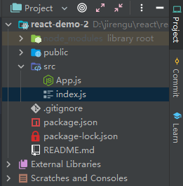

## 1、React 起手式

1. 通过

```javascript
import React from 'react';
import ReactDOM from 'react-dom';
```

引入React和ReactDom


2. 通过`React.createElement`创建虚拟DOM对象

   ```react
   let n = 0;
   const App=()=>React.createElement('div',null,[
   	n,
   	React.createElement(
   	'button',
   	{
   	  onClick:()=>{
   	  	n+=1
   	  	console.log(n);
   	  	ReactDOM.render(App(),document.querySelector('#app'))
   	  }
   	},
   	+1
   	)
   ])
   
   ReactDOM.render(App(),document.querySelector('#app'))
   ```

   **可是这样写代码太丑了！！！**

   

3. JSX -----> 就是`js`的拓展

### 2、通过 create-react-app 创建 react 项目

1. 输入命令

`create-react-app react-demo-1`

2. 删除无用文件

   

   

### 3、`JSX`的条件判断与循环控制

1、在`Vue`中

```vue
<templete>
  <div>
  	<div v-if='n%2===0'> n是偶数 </div>
  	<div v-else> n是基数 </div>
  </div>
</templete>
```


2、在`React`中

```react
const Component = () => {
  return
    n%2 === 0 ? <div>n是偶数</div> : <div>n是基数</div>
}
```


如果需要外面的<div>

```react
const Component = () => {
  return(
  	<div>	
    	{ n%2 === 0 ? <div>n是偶数</div> : <div>n是基数</div> }
  	</div> 	
  )
}
```


还可以写成

```react
const Component = () => {
  let inner
  if(n%2 === 0){
  	inner = <div> n是偶数 </div>
  }
  else{
  	inner = <div> n是基数 </div>
  }
  const content = (
  	<div>
  	  {inner}	
  	</div>
  )
  return content
}
```


#### 循环语句

在`Vue`里可以遍历数组和对象

```vue
<template>
 <div>
  <div v-for="(n, index) in numbers" :key="index">
 	下标 {{index}}，值为 {{n}}
  </div>
 </div>
</template>
```


在`React`中

```react
const Component = (props) => {
  return props.numbers.map((n,index)=>{
    return 下标 {{index}}，值为 {{n}}
  })
}

```


//需要外面的div，可以写成

```react
const Component = (props) => {
  return (<div>
    { props.numbers.map((n,index) => {
      return <div> 下标{index}，值为{n}</div>
  }) }
  </div>)
}
```


```react
const Component = (props) => {
  const array = []
    for(let i=0;i<props.numbers.length;i++){
      array.push(<div> {i}
      {props.numbers[i]}</div>)
    }
  return <div>{ array }</div>
}
```


[点我查看代码](https://github.com/johnnywwy/react-demo-1)