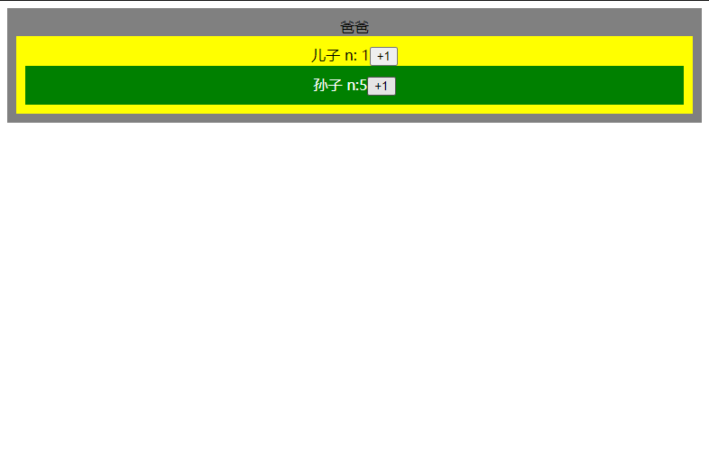
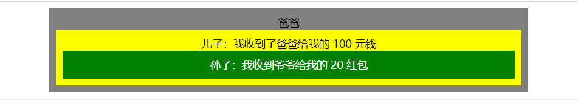

# React 组件和函数组件

### 1、元素与组件

1. `const div = React.createElement('div',...)` 是 React 元素（d小写）
2. `const Div = () => React.createElement('div',...)` 是React 组件（D大写）	

---

2. 什么是组件
   1. 就目前而言，一个返回 React 元素的**函数**就是组件

---

3. React 两种组件

   1. 函数组件

      ```javascript
      function Welcome(props){
          return <h1> 
              Hello, {props.name}
          </h1>;
      }
      使用方法：<Welcome name='frank'>
      ```

   2. 类组件

      ```javascript
      class Welcome extends React.Component{
          render(){
              return <h1>Hello,{this.props.name}</h1>
          }
      }
      使用方法：<Welcome name='frank'/>
      ```
      
   3. 需要注意`<Welcome />`并不是在写`html`标签
   
      `<div/>`在React中会被翻译为 `React.CreateElement('div')`
   
      `<Welcome />` 会背翻译为 `React.CreateElement(Welcome)`
   
      你可以在[bable online]((https://babeljs.io/repl#?browsers=defaults%2C%20not%20ie%2011%2C%20not%20ie_mob%2011&build=&builtIns=false&corejs=3.21&spec=false&loose=false&code_lz=Q&debug=false&forceAllTransforms=false&shippedProposals=false&circleciRepo=&evaluate=false&fileSize=false&timeTravel=false&sourceType=module&lineWrap=true&presets=env%2Creact%2Cstage-2&prettier=false&targets=&version=7.17.11&externalPlugins=&assumptions=%7B%7D))中查看 React 是如何理解的

### 2、小试牛刀

用`React`完成一下例子



```react
import React from 'react'
import './style.css'

function App() {
  return (
    <div className="App">
      爸爸
      <Son/>
    </div>
  );
}

class Son extends React.Component {
  constructor() {
    super();
    this.state = {
      n: 0
    }
  }

  add() {
    // this.state.n += 1 为什么不行
    this.setState({n: this.state += 1})
  }

  render() {
    return (
      <div className="Son">
        儿子n：{this.state.n}
        <button onClick={() => {
          this.add()
        }}>+1
        </button>
        <Grandson/>
      </div>
    )
  }
}

const Grandson = () => {
  const [n, setN] = React.useState(0)
  return (
    <div className="Grandson">
      孙子 n：{n}
      <button onClick={() => setN(n + 1)}>+1</button>
    </div>
  )
}


export default App;

```

`style.css`

```css
* {
  padding: 0;
  margin: 0;
}
.App {
  background: grey;
  width: 80vw;
  margin: 10px auto;
  text-align: center;
  padding: 10px;
}
.Son {
  background: yellow;
  padding: 10px;
}

.Grandson {
  background: green;
  padding: 10px;
  color: white;
}
```

[代码如下](https://github.com/johnnywwy/react-demo-1/commit/2057a824469df644de38fea5901bc18fcf87c242)

### 3、`React` 如何使用 `props`



```react
import React from 'react'
import './style.css'

function App() {
  const money = 100
  return (
    <div>
      <div className="App">
        爸爸
        <Son messageForSon={money}/>
      </div>
      <hr/>
    </div>

  );
}

class Son extends React.Component {
  constructor() {
    super();
    this.state = {
      n: 0
    }
  }
  render() {
    const money = 20;
    return (
      <div className="Son">
        儿子：我收到了爸爸给我的 {this.props.messageForSon} 元钱
        <Grandson messageForGrandSon={money}/>
      </div>
    )
  }
}

const Grandson = (props) => {
  // const [n, setN] = React.useState(0)
  return (
    <div className="Grandson">
      孙子：我收到爷爷给我的 {props.messageForGrandSon} 红包
    </div>
  )
}


export default App;

```


### 4、如何使用 `state`

##### 类组件

```react
class Son extends React.Component {
  constructor() {
    super()
    this.state = {
      n: 0
    }
  }
  add() {
    // this.setState({n: this.state.n += 1})
    //  牛逼的前端这样写
    this.setState((state) => {
      const n = state.n + 1
      console.log(n)
      return {n}
    })
  }

  render() {
    return (
      <div className="Son">
        儿子 n: {this.state.n}
        <button onClick={() => this.add()}>+1</button>
        <GrandSon/>
      </div>
    )
  }
}
```


##### 函数组件

```react
const GrandSon = () => {
  const [n, setN] = React.useState(0)
  return (
    <div className="Grandson">
      孙子 n：{n}
      <button onClick={() => setN(n + 1)}>+1</button>
    </div>
  )
}
```

[代码如下](https://github.com/johnnywwy/react-demo-1/commit/46d8bb817e10ceb175607b94bd1369a708b8a8a6)


