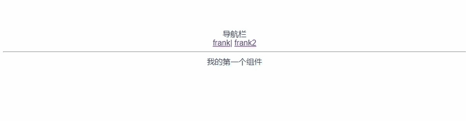
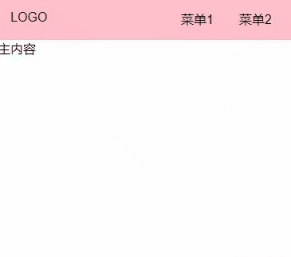

# Vue 3造轮子

---

### 1、前期准备

1. 新建文件夹，命名为`Vue3`，安装`vite` 

   ```bash
   yarn global add create-vite-app@1.18.0
   ```

2. 创建项目目录

   ```
   cva gulu-ui
   ```

3. 进入目录，并运行

   ```bash
   cd gulu-ui
   yarn
   yarn dev
   ```

4. 用 VScode 或者 webStrome 打开目录，准备写代码

> ##### 小总结：
>
> Vue2 和 Vue3 的区别
>
> 1. 90% 的写法完全一致，除了以下几点
> 2. Vue3 的 templete 支持多个根标签，vue2 不支持
> 3. Vue3 有 createApp()，而 Vue2 的是 new Vue()
> 4. createApp(组件)，new Vue({templent,render})

### 2、开始写代码

1. 认识文件 

2. 引入`Vue Router 4`

   ```bash
   yarn add vue-router@4.0.14
   ```

3. 初始化`Vue Router`

   1. 将`main.js`改为`main.ts`
   2. 注意`index.html`中也需要修改为`main.ts`

   ```html
   <script type="module" src="/src/main.ts"></script>
   ```

   `main.ts`代码如下

   ```ts
   import {createApp} from 'vue';
   import App from './App.vue';
   import './index.css';
   import {createWebHashHistory, createRouter} from 'vue-router';
   import Frank from './components/Frank.vue';
   import Frank2 from './components/Frank2.vue';
   
   const history = createWebHashHistory();
   const router = createRouter(
     {
       history: history,
       routes: [
         {path: '/', component: Frank},
         {path: '/xxx', component: Frank2}
       ]
     }
   );
   
   const app = createApp(App);
   app.use(router);
   app.mount('#app');
   ```

   `App.vue`代码如下

   ```vue
   <template>
     <div>导航栏</div>
     <router-link to="/">frank</router-link>|
     <router-link to="/xxx">frank2</router-link>
     <hr/>
     <router-view/>
   </template>
   
   <script>
   export default {
     name: 'App',
   }
   </script>
   ```

   在`components`下新建`Frank2.vue`，代码如下

   ```vue
   <template>
     <div>
       Frank2
     </div>
   </template>
   ```

   效果如下：



4. 在`src`目录下新建`views`目录，并分别新建`Doc.vue`和`Home.vue`

5. `Doc.vue` HTML 框架如下

   ```vue
   <template>
     <div>
       Doc 页面
       <div class="topnav">
         <div class="logo"></div>
         <div class="menu"></div>
       </div>
       <div class="content">
         <aside>边栏</aside>
         <main>主内容</main>
       </div>
     </div>
   </template>
   ```

6. `Home.vue` HTML 框架如下

   ```vue
   <template>
     <div>
       Home 页面
       <div class="topnav">
         <div class="logo"></div>
         <div class="menu"></div>
       </div>
       <div class="banner">
         <h1>咕噜 UI</h1>
         <h2>一个还不错的 UI 框架</h2>
         <p>
           <a>Github</a>
           <a>开始</a>
         </p>
       </div>
     </div>
   </template>
   ```

7. `App.vue`如下

   ```vue
   <template>
     <router-view/>
   </template>
   
   <script>
   export default {
     name: 'App',
   }
   </script>
   ```

8. 删除`Frank.vue`、`Frank2.vue`和`HelloWorld.vue`

9. 安装`sass`

   ```bash
   yarn add sass@1.26.10
   ```

   将`package.json`里面的`"dependencies"`剪切并粘贴至`"devDependencies"`即可消除报错

   


### 3、初始化`index.scss`文件

```scss
* {
  margin: 0;
  padding: 0;
  box-sizing: border-box;
}

ul, li {
  list-style: none;
}

a {
  text-decoration: none;
  color: inherit;

  &:hover {
    border-bottom: 1px solid;
    cursor: pointer;
  }
}

body {
  font-size: 16px;
  // 为什么这样写 font-family
  // 答案见 https://github.com/zenozeng/fonts.css/
  font-family: -apple-system, "Noto Sans", "Helvetica Neue", Helvetica, "Nimbus Sans L", Arial, "Liberation Sans", "PingFang SC", "Hiragino Sans GB", "Noto Sans CJK SC", "Source Han Sans SC", "Source Han Sans CN", "Microsoft YaHei", "Wenquanyi Micro Hei", "WenQuanYi Zen Hei", "ST Heiti", SimHei, "WenQuanYi Zen Hei Sharp", sans-serif;

}
```

### 4、`Home.vue` 组件


```vue
<template>
  <div>
    <Topnav/>
    <div class="banner">
      <h1>咕噜 UI</h1>
      <h2>一个还不错的 UI 框架</h2>
      <p class="actions">
        <a href="https://github.com">Github</a>
        <router-link to="/doc">开始</router-link>
      </p>
    </div>
  </div>
</template>

<script lang="ts">
import Topnav from '../components/Topnav.vue';

export default {
  components: {Topnav}
};

</script>

<style lang="scss" scoped>
.topnav {
  border: 1px solid red;
  background: pink;
  display: flex;
  padding: 16px;

  > .logo {
    max-width: 6em;
    margin-right: auto;
  }

  > .menu {
    display: flex;
    white-space: nowrap;
    flex-wrap: nowrap;

    > li {
      margin: 0 1em;
    }
  }
}
.banner {
  padding: 100px 0;
  display: flex;
  justify-content: center;
  align-items: center;
  flex-direction: column;
  background: lightgreen;
  > .actions {
    padding: 8px 0;
    a {
      margin: 0 8px;
      background: #fff;
      display: inline-block;
      $h: 28px;
      height: $h;
      line-height: $h;
      border-radius: $h/2;
      padding: 0 8px;
    }
  }

}

</style>
```

### 5、`Doc.vue` 组件

```vue
<template>
  <div>
    <Topnav/>
    <div class="content">
      <aside>边栏</aside>
      <main>主内容</main>
    </div>
  </div>
</template>
<script lang="ts">
import Topnav from '../components/Topnav.vue';

export default {
  components: {Topnav}
};
</script>
```

### 6、将`Topnav.vue`组件进行抽离

1. 在`components`中新建`Topnav.vue`文件

   ```vue
   <template>
     <div class="topnav">
       <div class="logo">LOGO</div>
       <ul class="menu">
         <li>菜单1</li>
         <li>菜单2</li>
       </ul>
     </div>
   </template>
   
   <style lang="scss" scoped>
   .topnav {
     background: pink;
     display: flex;
     padding: 16px;
   
     > .logo {
       max-width: 6em;
       margin-right: auto;
     }
   
     > .menu {
       display: flex;
       white-space: nowrap;
       flex-wrap: nowrap;
   
       > li {
         margin: 0 1em;
       }
     }
   }
   
   </style>
   ```


### 7、实现`aside`切换


1. 在`App.vue`中声明`asideVisible`，使用`provide`提供元素给子组件

   ```vue
   <script lang="ts">
   import {provide, ref} from 'vue';
   
   export default {
     name: 'App',
     setup() {
       const asideVisible = ref(false);//
       provide('xxx',asideVisible)
     }
   };
   </script>
   ```

2. 在`topnav`使用`inject`获取元素`xxx`的值

   ```vue
   <script lang="ts">
   import {inject, Ref} from 'vue';
   
   export default {
     setup() {
       const asideVisible = inject<Ref<boolean>>('xxx');
       console.log('topnav 获取的 asideVisible:', asideVisible.value);
     }
   };
   </script>
   ```

3. 在`Doc.vue`使用`inject`获取`xxx`的值

   ```vue
   <script lang="ts">
   import Topnav from '../components/Topnav.vue';
   import {inject, Ref} from 'vue';
   
   export default {
     components: {Topnav},
     setup(){
       const asideVisible = inject<Ref<boolean>>('xxx');
       console.log('DocAside 获取的 asideVisible:',asideVisible.value);
       return{asideVisible}
     }
   };
   </script>
   ```

4. 在`topnav`组件中设置点击事件

   ```html
    <div class="logo" @click="toggleAside">LOGO</div>
   ```

5. 在`topnav`中编写切换`toggleAside`事件

   ```vue
   <script lang="ts">
   import Topnav from '../components/Topnav.vue';
   import {inject, Ref} from 'vue';
   
   export default {
     setup() {
       const asideVisible = inject<Ref<boolean>>('xxx');
       console.log('topnav 获取的 asideVisible:', asideVisible.value);
       const toggleAside = () => {
         asideVisible.value = !asideVisible.value;
       };
       return{toggleAside}
     }
   };
   </script>
   ```

6. `Doc.vue`的`aside`便签，监听`asideVisible`的变化

   ```html
    <aside v-if="asideVisible">
   ```

7. 最终效果

   


### 8、模仿`Vue`官网的交互

1. 在手机界面，让菜单隐藏起来

   ```scss
   @media (max-width: 500px) {
       > .menu {
         display: none;
       }
       > .logo {
         margin: 0 auto
       }
       > .toggleAside {
         display: inline-block;
       }
     }
   ```

2. 添加按钮，而不是点击LOGO显示`aside`，在`topnav`组件下添加新的标签

   ```vue
   <span class="toggleAside" @click="toggleAside"></span>
   ```

3. 添加`toggleAside`的`CSS`

   ```scss
   > .toggleAside {
       height: 24px;
       width: 24px;
       background: red;
       position: absolute;
       left: 16px;
       top: 50%;
       transform: translateY(-50%);
       display: none;
     }
   ```

4. 通过页面宽度确定`asideVisible`的值

   在`App.vue`中

   ```vue
   <script lang="ts">
   import {provide, ref} from 'vue';
   import {router} from './router';
   
   export default {
     name: 'App',
     setup() {
       const width = document.documentElement.clientWidth;
       const asideVisible = ref(width > 500);
       provide('asideVisible', asideVisible);
   
       router.afterEach(() => {
         if(width<=500){
           asideVisible.value = false;
         }
       });
     }
   };
   </script>
   ```

5. 路由之间的切换

   将路由单独抽离出来，命名为`router.ts`

   ```ts
   import {createRouter, createWebHashHistory} from 'vue-router';
   import Home from './views/Home.vue';
   import Doc from './views/Doc.vue';
   import SwitchDemo from './components/SwitchDemo.vue';
   import ButtonDemo from './components/ButtonDemo.vue';
   import DialogDemo from './components/DialogDemo.vue';
   import TabsDemo from './components/TabsDemo.vue';
   import DocDemo from './components/DocDemo.vue';
   
   const history = createWebHashHistory();
   export const router = createRouter(
     {
       history: history,
       routes: [
         {path: '/', component: Home},
         {
           path: '/doc', component: Doc, children: [
             {path: '', component: DocDemo},
             {path: 'switch', component: SwitchDemo},
             {path: 'button', component: ButtonDemo},
             {path: 'dialog', component: DialogDemo},
             {path: 'tabs', component: TabsDemo},
           ]
         }
       ]
     }
   );
   ```

   在`Doc.vue`组件中，添加`router-view`

   ```vue
   <main>
   	<router-view/>
   </main>
   ```

   完善`Doc.vue`的`CSS`

   ```scss
   <style lang="scss" scoped>
   .layout {
     display: flex;
     flex-direction: column;
     height: 100vh;
   
     > .nav {
       flex-shrink: 0;
     }
   
     > .content {
       flex-grow: 1;
       padding-top: 60px;
       padding-left: 156px;
       @media (max-width: 500px) {
         padding-left: 0;
       }
     }
   }
   
   .content {
     display: flex;
   
     > aside {
       flex-shrink: 0;
     }
   
     > main {
       flex-grow: 1;
       padding: 16px;
       background: lightgreen;
     }
   }
   
   aside {
     background: skyblue;
     width: 150px;
     padding: 70px 16px 16px 16px;
     position: fixed;
     top: 0;
     left: 0;
     height: 100%;
   
     > h2 {
       margin-bottom: 4px;
     }
   
     > ol {
       > li {
         padding: 4px 0;
       }
     }
   }
   
   main {
     overflow: auto;
   }
   </style>
   ```


### 9、父子组件通信

1. 使用`:value`和`@input`让子父组件进行通讯

   在父组件`SwitchDemo`，通过`$event`获取最新的值

   ```vue
   <Switch :value="y" @input="y = $event"/>
   <script lang="ts">
   export default {
   setup() {
       const y = ref(false);
       return {y};
     }
   }
   </script>
   ```

   子组件`Switch`， props 父组件传过来的属性，context当前实例

   ```html
   <button @click="toggle" :class="{checked:value}">
   ... 
   export default {
     props: {
       value: Boolean
     },
     setup(props, context) {
       const toggle = () => {
         context.emit('update', !props.value);
       };
       return {toggle};
     }
   };
   
   ```

   `$event`是`emit`的第二个参数，`emit(事件名,事件参数)`

2. 使用`Vue3`的`v-model` 对父子通信进行简化

   父组件`SwitchDemo`

   ```vue
   <Switch v-model:value="y"/>
   ```

   子组件`Switch`

   ```tsx
   export default {
     props: {
       value: Boolean //这里值为value
     },
     setup(props, context) {
       const toggle = () => {
         context.emit('update:value', !props.value); //对应update: 后面的值
       };
       return {toggle};
     }
   };
   ```

##### 总结：

1. 区分 value="true" 和 :value="true" 的区别
2. 使用 CSS transition 添加过渡动画
3. 使用 ref 创建内部数据
4. 使用 :value 和 @input 让父子组件进行通讯
5. 使用 $enent
6. 使用 v-model
7. 框架就是把你框起来 不允许你直接修改 props

### 10、Vue3属性绑定

1. Vue3 默认会把你传给这个组件上的所有事件，绑定到根元素

2. 取消继承外部所有事件

   父组件

   ```
   <Button @click="onClick" @focus="onClick" @mouseover="onClick" 					size="small">
   	你好
   </Button>
   ```

   子组件

   ```vue
   <templete>
   	<div :size='size'>//分离部分事件
   		<button v-bind="$attrs"> //父组件的所有事件都绑定到子组件的button上
           <button v-bind="rest">//分离部分事件
               <slot />
   		</button>
   	</div>
   </templete>
   <script>
   export default{
   	inheritAttrs:false //取消继承
       //分离部分事件
       setup(props,content){
           const {size,...rest}= content.attrs
           return {size,...rest}
       }
   }
   </script>
   ```

   总结：

   1. 默认所有属性都绑定到根元素

   2. 使用  `inheritAttrs: false`  可以取消默认绑定

   3. 使用 `$attrs`或者 `content.attrs`获取所有属性
   4. 使用 `v-bind='$attrs'`批量绑定属性
   5. 使用`const {size,...rest}= content.attrs`将属性分开

### 11、UI库 CSS 注意事项

1. #### 不能使用scoped

2. #### 必须加前缀，所有class都要加，例如`.guli-button`

### 12. CSS 最小影响元素

```css
[class^="gulu-"], [class*=" gulu-"]{
    ......
}
```


### 13、Dialog 组件

### 14、如何在运行时确认子组件类型

```ts
setup(props, context) {
    console.log({...context});
    const defaults = context.slots.default();
    console.log(defaults[0].type === Tab);
    return {defaults};
  }
```


### 15、用JS获取插槽内容

```vue
<template>
  <div>
    <div v-for="(t,index) in title" :key="index">{{ t }}</div>
    <component v-for="(c,index) in defaults" :is="c" :key="index"/>
  </div>
</template>

<script lang="ts">
import Tab from './Tab.vue';

export default {
  setup(props, context) {
    const defaults = context.slots.default();
    defaults.forEach((tag) => {
      if (tag.type !== Tab) {
        throw new Error('Tab 子标签必须是 Tab');
      }
    });
    const title = defaults.map((tag) => {
      return tag.props.title;
    });
    return {defaults, title};
  }
};
</script>
```

### 16、关于钩子

```
onMounted() //在挂载时执行，只执行一次
onUpdated() //在页面更新后执行
watchEffect() //在第一次挂载和后面的更新中执行
```

### 17、TypeScript 泛型

```ts
const indicator = ref<HTMLDivElement>(null);
```


### 18、计算下划线宽度

```ts
const {width} = selectedItem.value.getBoundingClientRect();
indicator.value.style.width = width + 'px';
const {left: left1} = container.value.getBoundingClientRect();
const {left: left2} = selectedItem.value.getBoundingClientRect();
        const left = left2 - left1;
        indicator.value.style.left = left + 'px';
```


