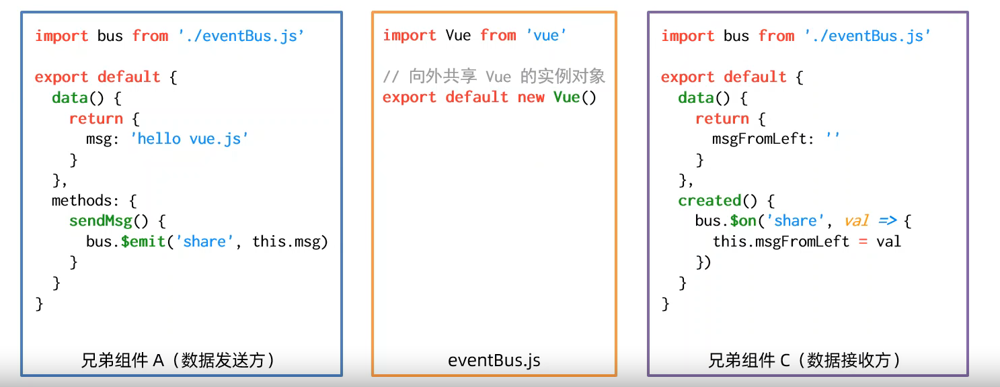

## Vue2 组件间的通信方式

### 1、父 -> 子

`myParent.vue`

```vue
<template>
  <div class="wrapper">
    <h4>我是爸爸</h4>
    <MySon :msg='message' :user='userinfo'></MySon>
  </div>
</template>

<script>
import MySon from '@/components/mySon'
export default {
  components: {MySon},
  data() {
    return{
      message: 'hello world',
      userinfo: {name: 'cxk', age: 22}
    }
  }
}
</script>

<style scoped>
.wrapper{
  border: 1px solid red;
  width: 500px;
  height: 500px;
  background: skyblue;

}
</style>
```

`mySon.vue`

```vue
//子组件
<template>
  <div class="wrapperSon">
    <h4>我是儿子</h4>
    <p>父组件中传过来的 msg 是: {{ msg }}</p>
    <p>父组件中传过来的 user 是: {{ user }}</p>
  </div>
</template>

<script>
export default {
  data() {
  },
  props: ['msg', 'user']
}
</script>

<style scoped>
.wrapperSon {
  width: 400px;
  height: 400px;
  background: pink;
  margin: 0 auto;
}
</style>
```


##### 需要注意的是：`props`中的值是只读的，意味着你不可以在`mySon`组件中直接修改`['msg', 'user']`，不建议直接修改哦

```html
<h4>我是儿子</h4>
<p>父组件中传过来的 msg 是: {{ msg }}</p>
<p>父组件中传过来的 user 是: {{ user }}</p>
<button @click="msg='哈哈哈哈'">修改msg</button> //错误修改
<button @click="user.name='鸡你太美'">修改msg</button> //正确修改
<script>
export default {
  data() {
    return{}
  },
  props: ['msg', 'user']
}
</script>

```


---

### 2、子 -> 父 传递

##### 自定义事件

`Son.vue`

```js
this.$emit('sendMoney', this.count)//sendMoney是自己定义的，所以叫自定义事件
```

`Parent.vue`

```vue
<h4>我是爸爸，我的私房钱 ----- {{ count }}</h4>

<MySonRight @sendMoney="getMoney"></MySonRight>
<script>
export default {
  data() {
    return {
      count: 0,
    }
  }
  methods: {
    getMoney(val) {
      this.count = val
    }
  }
}
</script>
```


---

### 3、兄弟组件之间通信

##### EventBus




`兄弟组件A`

```vue
<button @click="send">借钱给我兄弟</button>
<script>
//	1、导入eventBus
import bus from '@/components/eventBus'
export default {
  	data() {
      return {
      str: '支付宝到账100万元'
      }
  	},
    methods: {
    send() {
      //  2、通过 eventBus 发送数据
      bus.$emit('share',this.str)
    }
  }
}
</script>
```


创建`eventBus.js`

```js
import Vue from 'vue'
export default new Vue()
```


`兄弟组件B`

```vue
<p>{{ moneyFromSon1 }}</p>
<script>
import bus from '@/components/eventBus'

export default {
  data() {
    return {
      moneyFromSon1: ''
    }
  },
  // !!!需要在组件创建时绑定 $on 事件
  created() {
    bus.$on('share', (val) => {
      console.log('兄弟给我钱了', val)
      this.moneyFromSon1 = val
    })
  }
}
</script>
```


