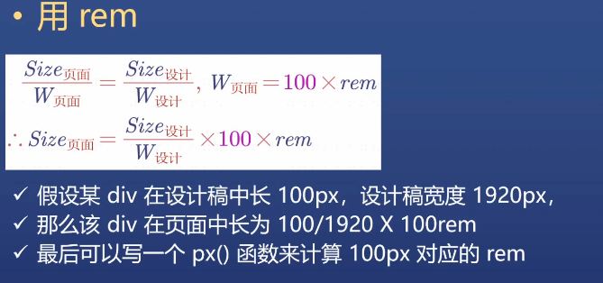

## 大屏项目实战

### 1、关于大屏适配公式

1. 如果屏幕很宽，左右居中（21：9）
2. 如果屏幕很高，上下居中（4 ：3）

##### 具体算法：


### 2、rem 计算公式

`rem` 就是 `<html>`元素的 `font-size`，默认为 16px (浏览器默认font-size)
`em` 是字体中 ‘一个字’ 的宽度
`px` 像素大小


考虑到需要动态适配，不能使用像素单位，所以单位以屏幕宽度为标准 `页面显示宽度 / 100 = 1rem`，就能完美还原设计稿；
 在页面渲染之前，使用 JS 获取设备宽度并设置 `页面显示宽度 = 100rem`




通过计算公式，只需要知道一个元素在设计图中的尺寸就可以计算出在页面的显示尺寸；
可以通过自定义一个函数来计算出页面显示尺寸，从而达到动态适配的效果


### 如何实施

在 `index.html` 的 `head`中获取浏览器宽高

```js
  <script>
    const clientWidth = document.documentElement.clientWidth
    const clientHeight = document.documentElement.clientHeight
    window.pageWidth = clientWidth / clientHeight > 16 / 9 ? clientHeight * (16 / 9) : clientWidth
    const pageHeight = pageWidth / (16 / 9)
    const string = `
        <style>html{
          font-size: ${pageWidth / 100}px
        }</style>
      `
    document.write(string)
  </script>
```


在 `body` 中将获得的尺寸给根组件

```js
<body>
<div id="root"></div>
<script>
  root.style.width = pageWidth + 'px'
  root.style.height = pageHeight + 'px'
  root.style.marginTop = (clientHeight - pageHeight) / 2 + 'px'
</script>
<script type="module" src="/src/main.tsx"></script>
</body>
```


给根组件 div 样式

```css
<style>
  #root {
    margin: 0 auto;
    background: lightgreen
  }
</style>
```


随意改变窗口大小，刷新之后页面始终保持水平垂直居中，而且页面元素大小自适应，页面字体始终为 `pageWidth / 100` px，也就是 1rem。

将总结出来的计算公式封装成一个函数，使用时只需要引入文件即可

```js
@function px($n) {
  @return $n / 设计图宽度* 100rem;
}

//  使用
.x {
  height: px(100)
  width: px(100)
}
```

