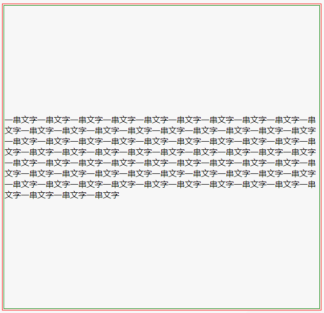
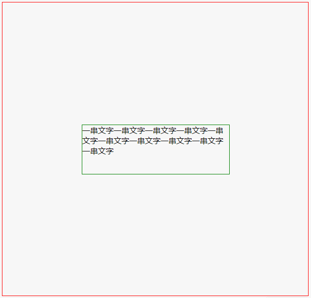
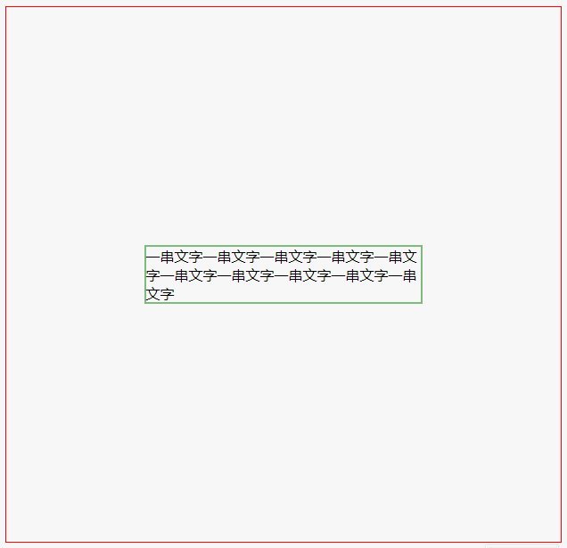
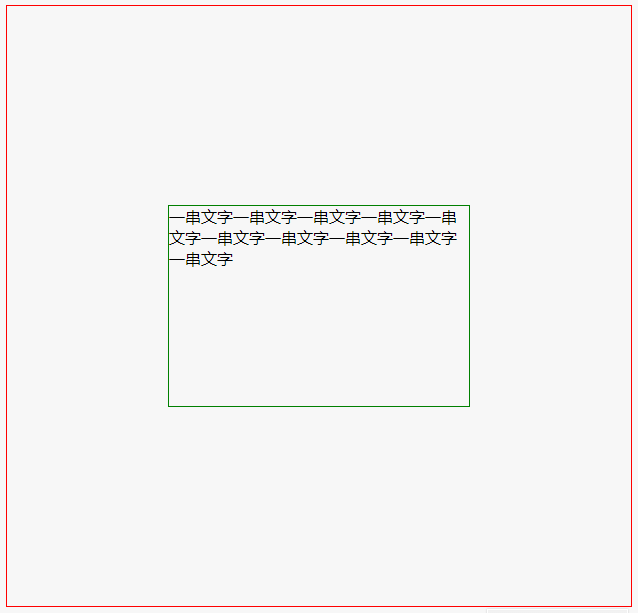
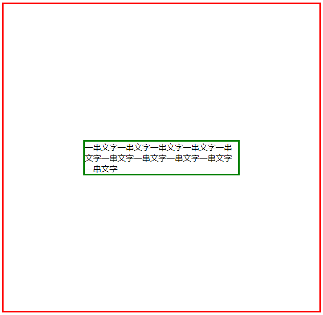
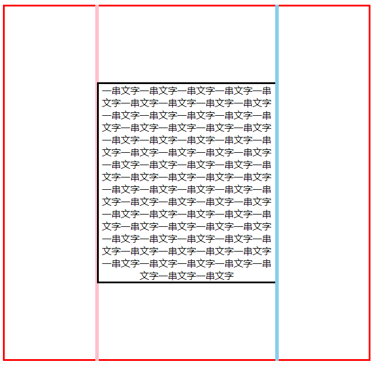

## 实现垂直居中的几种方式

##### 如果 .parent 的 height 不写，你只需要 padding: 10px 0; 就能将 .child 垂直居中；

##### 如果 .parent 的 height 写死了，就很难把 .child 居中，以下是垂直居中的方法。

##### 忠告：能不写 height 就千万别写 height。

### 1、使用 `<table>` 标签


```html
<!DOCTYPE html>
<html>
<head>
  <meta charset="utf-8">
  <title>JS Bin</title>
</head>
<body>
  <table class="parent">
    <tr>
      <td class="child">
      一串文字一串文字一串文字一串文字一串文字一串文字一串文字一串文字一串文字一串文字一串文字一串文字一串文字一串文字一串文字一串文字一串文字一串文字一串文字一串文字一串文字一串文字一串文字一串文字一串文字一串文字一串文字一串文字一串文字一串文字一串文字一串文字一串文字一串文字一串文字一串文字一串文字一串文字一串文字一串文字一串文字一串文字一串文字一串文字一串文字一串文字一串文字一串文字一串文字一串文字一串文字一串文字一串文字一串文字一串文字一串文字一串文字一串文字一串文字一串文字一串文字一串文字一串文字一串文字一串文字一串文字一串文字一串文字一串文字一串文字
      </td>
    </tr>
  </table>
</body>
</html>
```

```css
.parent{
  border: 1px solid red;
  height: 600px;
}

.child{
  border: 1px solid green;
}
```

实现效果




---

### 2、`<position>` 配合 `<margin-top>`

```html
<!DOCTYPE html>
<html>
<head>
  <meta charset="utf-8">
  <title>JS Bin</title>
</head>
<body>
  <div class="parent">
    <div class="child">
      一串文字一串文字一串文字一串文字一串文字一串文字一串文字一串文字一串文字一串文字
    </div>
  </div>
</body>
</html>
```

```style
.parent{
  height: 600px;
  border: 1px solid red;
  position: relative;
}
.child{
  border: 1px solid green;
  width: 300px;
  position: absolute;
  top: 50%;
  left: 50%;
  margin-left: -150px;
  height: 100px;
  margin-top: -50px;
}
```

实现效果




---

### 3、`position` 配合 `transform: transition`

```
<!DOCTYPE html>
<html>
<head>
  <meta charset="utf-8">
  <title>JS Bin</title>
</head>
<body>
  <div class="parent">
    <div class="child">
      一串文字一串文字一串文字一串文字一串文字一串文字一串文字一串文字一串文字一串文字
    </div>
  </div>
</body>
</html>
```

```css
.parent{
  height: 600px;
  border: 1px solid red;
  position: relative;
}
.child{
  border: 1px solid green;
  position: absolute;
  top: 50%;
  left: 50%;
  transform: translate(-50%,-50%);
}
```

实现效果




---

### 4、`position` 配合 `margin: auto`

```html
<!DOCTYPE html>
<html>
<head>
  <meta charset="utf-8">
  <title>JS Bin</title>
</head>
<body>
  <div class="parent">
    <div class="child">
      一串文字一串文字一串文字一串文字一串文字一串文字一串文字一串文字一串文字一串文字
    </div>
  </div>
</body>
</html>
```

```css
.parent{
  height: 600px;
  border: 1px solid red;
  position: relative;
}
.child{
  border: 1px solid green;
  position: absolute;
  width: 300px;
  height: 200px;
  margin: auto;
  top: 0;
  bottom: 0;
  left: 0;
  right: 0;
}
```

实现效果




---

### 5、`flex`布局

```html
<!DOCTYPE html>
<html>
<head>
  <meta charset="utf-8">
  <title>JS Bin</title>
</head>
<body>
  <div class="parent">
    <div class="child">
      一串文字一串文字一串文字一串文字一串文字一串文字一串文字一串文字一串文字一串文字
    </div>
    
  </div>
</body>
</html>
```

```css
.parent{
  height: 600px;
  border: 3px solid red;
  
  display: flex;
  justify-content: center;
  align-items: center;
}
.child{
  border: 3px solid green;
  width: 300px;
}
```

实现效果




---

### 6、100% 高度的 `after before` 加上 `inline block`

```html
<!DOCTYPE html>
<html>
<head>
  <meta charset="utf-8">
  <title>JS Bin</title>
</head>
<body>
  <div class="parent">
    <span class=before></span><div class="child">
      一串文字一串文字一串文字一串文字一串文字一串文字一串文字一串文字一串文字一串文字一串文字一串文字一串文字一串文字一串文字一串文字一串文字一串文字一串文字一串文字一串文字一串文字一串文字一串文字一串文字一串文字一串文字一串文字一串文字一串文字一串文字一串文字一串文字一串文字一串文字一串文字一串文字一串文字一串文字一串文字一串文字一串文字一串文字一串文字一串文字一串文字一串文字一串文字一串文字一串文字一串文字一串文字一串文字一串文字一串文字一串文字一串文字一串文字一串文字一串文字一串文字一串文字一串文字一串文字一串文字一串文字一串文字一串文字一串文字一串文字   
    </div><span class=after></span>
  </div>
</body>
</html>
```

```css
.parent{
  border: 3px solid red;
  height: 600px;
  text-align: center;
}

.child{
  border: 3px solid black;
  display: inline-block;
  width: 300px;
  vertical-align: middle;
}

.parent .before{
  outline: 3px solid pink;
  display: inline-block;
  height: 100%;
  vertical-align: middle;
}
.parent .after{
  outline: 3px solid skyblue;
  display: inline-block;
  height: 100%;
  vertical-align: middle;
}
```

实现效果



